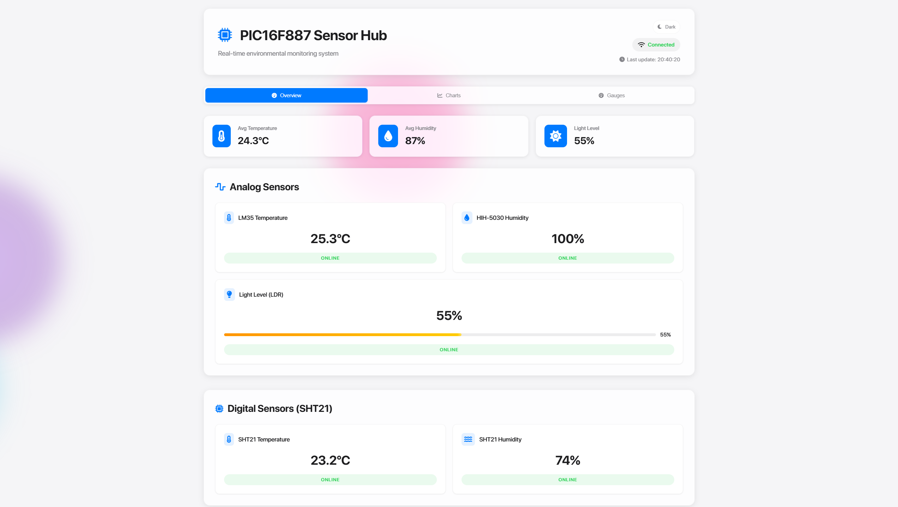

# PIC16F887 Weather Station

Sistema de monitorizare meteo folosind microcontroller-ul PIC16F887 cu senzori multipli și comunicare UART cu ESP32.

## Caracteristici

- **Senzori analogici**: LM35 (temperatură), HIH-5030 (umiditate), LDR (lumină)
- **Senzor digital**: SHT21 (temperatură/umiditate via I2C)
- **Display**: LCD 16x2 cu mai multe moduri de afișare
- **Comunicare**: UART cu ESP32 pentru sincronizare timp și transmitere date
- **WebUI**: Interfață web pentru monitorizare în timp real
- **Alarmă**: Sistem de alarmă cu buzzer și countdown
- **Butoane**: 5 butoane pentru navigare și setări

## Conexiuni Hardware

### Senzori
- **LM35**: RA0/AN0 (temperatură analogică)
- **HIH-5030**: RA1/AN1 (umiditate analogică)
- **LDR**: RA2/AN2 (lumină analogică)
- **SHT21**: SCL=RC3, SDA=RC4 (I2C)

### Interfață
- **LCD**: RS=RC0, EN=RC1, D4-D7=RD4-RD7
- **Buzzer**: RA3
- **Butoane**: 
  - Alarmă: RA4
  - Senzori analogici: RB2
  - Senzor digital: RB0
  - Senzor lumină: RB3
  - Timp: RB1
- **UART**: TX=RC6, RX=RC7 (comunicare cu ESP32)

## Funcționalități

### Moduri de Afișare
1. **Welcome**: Mesaj de întâmpinare
2. **LM35**: Temperatură LM35 și umiditate HIH-5030
3. **SHT21**: Temperatură și umiditate SHT21
4. **LDR**: Nivel de lumină în procente
5. **Time**: Timpul curent sincronizat cu ESP32

### WebUI
ESP32-ul oferă o interfață web accesibilă prin browser pentru:
- Monitorizare în timp real a datelor de la senzori
- Vizualizare grafică a tendințelor
- Control și configurare remotă
- Istoric date



### Sistem de Alarmă
- Apăsarea butonului de alarmă adaugă 15 secunde
- Countdown vizual pe LCD
- Sunet buzzer la expirare

### Comunicare UART
- Transmite date senzori la ESP32 în format text
- Primește timpul curent de la ESP32
- Baud rate: 9600

## Compilare

Folosește MPLAB X IDE cu compilatorul XC8:

1. Deschide proiectul în MPLAB X IDE
2. Selectează PIC16F887 ca microcontroller
3. Configurează XC8 compiler
4. Build project

## Configurare

Microcontroller-ul este configurat pentru:
- Oscilator intern 4MHz
- Watchdog timer dezactivat
- Brown-out reset activat
- Low voltage programming dezactivat

## Utilizare

1. Pornește sistemul - va afișa o bară de încărcare
2. Folosește butoanele pentru navigare:
   - **RB2**: Senzori analogici (LM35 + HIH-5030)
   - **RB0**: Senzor digital (SHT21)
   - **RB3**: Senzor de lumină (LDR)
   - **RB1**: Timpul curent
   - **RA4**: Setează/adaugă timp la alarmă

## Protocol de Comunicare

### Date trimise către ESP32:
```
T1:25.3,H1:60,L:75,T2:25.1,H2:58
```

### Date primite de la ESP32:
```
TIME:14:30:25
```

## Adăugare Screenshot WebUI

Pentru a adăuga screenshot-ul cu WebUI-ul:

1. Creează un folder `images` în directorul proiectului:
   ```
   mkdir images
   ```

2. Fă un screenshot al WebUI-ului și salvează-l ca `webui-screenshot.png` în folderul `images`

3. Opțional, poți folosi și alte formate suportate:
   - `webui-screenshot.jpg`
   - `webui-screenshot.jpeg`
   - `webui-screenshot.gif`

4. Dacă vrei să adaugi mai multe imagini, poți crea o galerie:
   ```markdown
   ### Galerie WebUI
   
   
   
   ```
